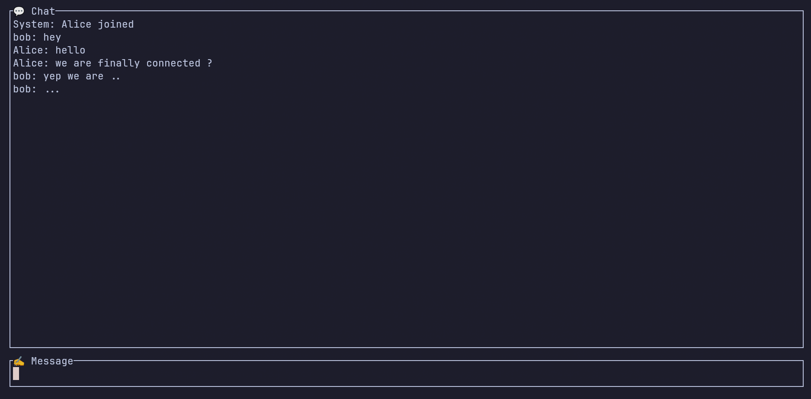

## 🖥️ TUI in the Rust P2P Chat App

### 📌 Introduction

This project uses [`ratatui`](https://github.com/tui-rs/ratatui) to create an interactive terminal UI for a peer-to-peer (P2P) chat application written in Rust. The interface provides real-time message display and message input features, enabling seamless CLI-based chatting.

---

### 🧱 Dependencies

```toml
[dependencies]
ratatui = "0.26"
crossterm = "0.27"
tokio = { version = "1", features = ["full"] }
```

---

### 🗂️ Components

#### `ChatState`

```rust
struct ChatState {
    messages: Vec<(String, String)>,
    input: String,
    users: HashMap<NodeId, String>,
}
```

- Stores the chat history as a list of `(username, message)` pairs.
- Holds the current input from the user.
- Maintains a map of known `NodeId`s to usernames.

#### `render_ui()`

```rust
fn render_ui(f: &mut Frame, state: &ChatState)
```

- Lays out the UI using `ratatui::layout`.
- Top pane: Chat history.
- Bottom pane: Current message input field.
- Displays message entries with the sender's name.

#### `chat_ui()`

```rust
async fn chat_ui(
    receiver: GossipReceiver,
    sender: GossipSender,
    node_id: NodeId,
    display_name: Option<String>,
) -> Result<()>
```

- Main async event loop.
- Initializes the TUI and listens for:
  - Keyboard events via `crossterm`.
  - Gossip events from the network.

- On input:
  - `Enter`: sends the message.
  - `Esc`: exits the chat.

- On receiving messages:
  - Updates the `ChatState`.
  - Broadcasts messages using `GossipSender`.

> The networking part is explained in the [Network](../docs/networking.md)

---

### 🎯 Keybindings

| Key           | Action                |
| ------------- | --------------------- |
| `Enter`       | Send typed message    |
| `Backspace`   | Delete last character |
| Any character | Add to input field    |
| `q` / `Esc`   | Quit chat             |

---

### 🧪 Terminal Interface Example



### ⚙️ Notes

- The UI is automatically redrawn every 100ms using `tokio::select!`.
- The cursor moves as you type, and remains in sync with the input buffer.
- Node announcements (username broadcasting) are handled via a `MessageBody::AboutMe` broadcast.
- Message sending includes a unique nonce for message ID.

---

### 📌 Conclusion

The `ratatui`-based interface in this P2P chat app provides a lightweight, responsive, and fully keyboard-driven chat experience—all within the terminal. It demonstrates how real-time networked applications can be both performant and user-friendly in Rust’s ecosystem.
